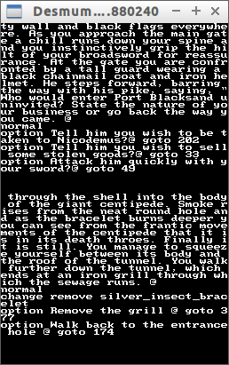

# Het Roversnest

(English version: see below)

Het Roversnest is een Nederlands tekstavontuur boek, een vertaling van 'City of Thieves' van Ian Livingstone.

 * [Wikipedia](https://nl.wikipedia.org/wiki/Het_Roversnest)

## Ik wil helpen!

Top! Email Richel of je een collaborator kunt worden.

## Hoe kan ik helpen?

Bekijk de 'Issues'. Begin eerst een paar van de gemakkelijke te doen. 

Dit zijn de gemakkelijkere:
 * Issue #3: Hoofdstukken toevoegen

Moeilijker
 * Issue #12: Test-Je-Geluk engine
 * Issue #4: Vecht engine
 * (Issue #1: Display op LCD)
 * (Issue #2: Input met knoppen)
 * Issue #6: Introverhaal erin

Moeilijkst:
 * Issue #5: Karakter generatie
 * Issue #7: Inventaris erin

## Wat zijn al die bestanden in de folder `Bestanden`?

De bestanden bevatten het verhaal van Het Roversnest.

## Waarom staan al die bestanden in de folder `Bestanden`?

Dit project is in eerste instantie bedoeld voor Arduino. 
En een Arduino heeft niet genoeg RAM en FLASH geheugen om een heel boek op te kunnen slaan. 
Een mini-SD kaart van 2 GB kan met gemak een heel boek opslaan. 
Daarom is staan er in de folder `Bestanden` bestanden die je op een SD kaart kunt kopieeren. 
Het programma `HetRoversnest.ino` (in de map `HetRoversnest`) leest deze dan uit.

# Hoe moet ik de bestanden invoeren?

Dit is afhankelijk van het het [soort hoofdstuk](Hoofdstuksoorten.md).

# Wat zijn de nummers van de voorwerpen?

Zie [nummers van de voorwerpen](Voorwerpnummers.md).

## Hoe gebruik ik git en GitHub?

Zie [Hoe gebruik ik git en GitHub?](HoeGebruikIkGitEnGitHub.md)

## Zijn er ook kaarten van het spel?

Hier:

 * [Mooie kaart van Graham Parker](KaartZwartzand.pdf)
 * [Simpele kaart van Nick Folley](Kaart.jpg)

# City Of Thieves

City Of Thieves is a text adventure game after the English gamebook with the same name by Ian Livingstone. 

 * [Wikipedia](https://en.wikipedia.org/wiki/City_of_Thieves_%28gamebook%29)

## I want to help!

Great!

There is need for some testing and spelling corrections. Create a new Issue or email @richelbilderbeek.

## Wat are all those files in the folder `Files`?

Those files contain the story of 'City Of Thieves'.

## Why are all those files in the folder `Bestanden`?

This game is intended to work on Arduino. An Arduino does not have enough memory to store an entire book. A mini-SD, however, will have no problem with that. Therefore, the idea is that the game text can be copied on an SD card, which itself will be put on an SD card shield, so the Arduino code will only have to do the game logic.

